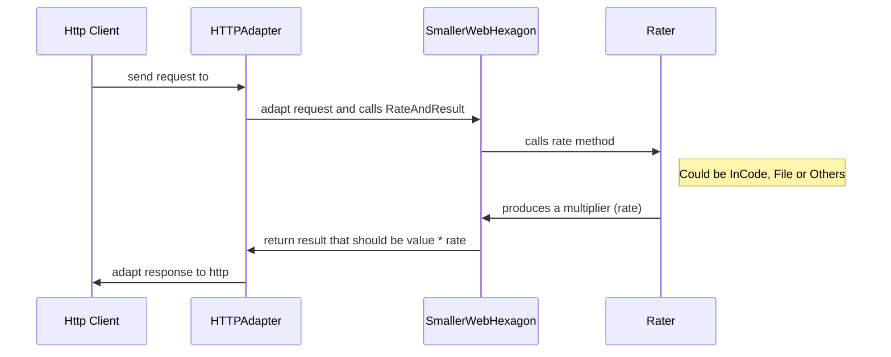
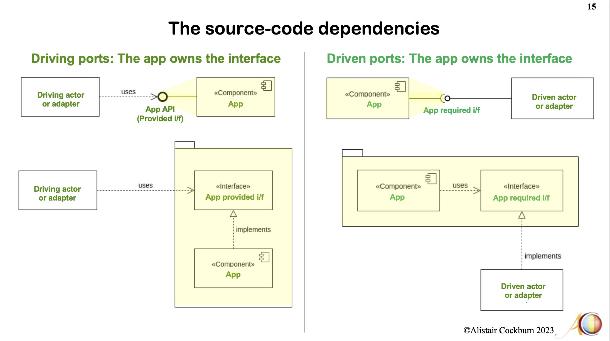
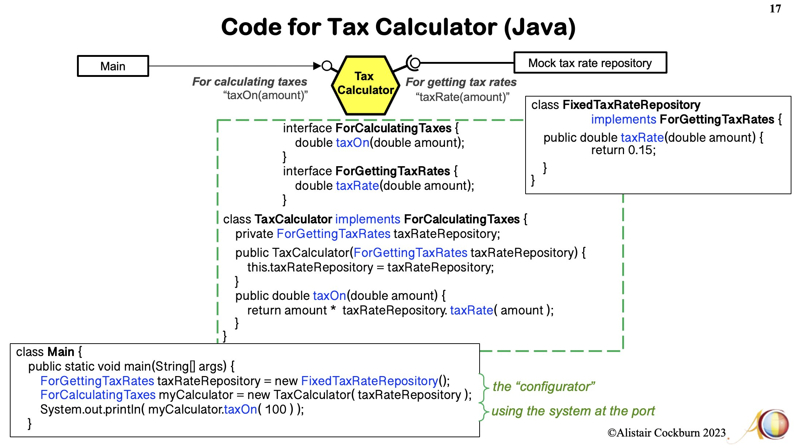

# Smaller Web Hexagon

Based on Alistair Cockburn [example repo](https://github.com/totheralistair/SmallerWebHexagon/).

Illustration of a simple hexagon with one user (left) port and one database (right) port.

It simply calculates the formula:

    result = input * rate

e.g.

    result = 100 * 1.1 = 110

The user port is connected to either the web or to a test harness, with or without the server adapter.

The database port looks up the rate in a database, either in-the-code database, or from a file.

The startup decides how the wiring goes.

## Running the Application

Run `go run .` to get the web UI on port 9292

## Running Tests

Run `go test` to run tests.

Notes:

* HttpAdapter and test cases are "primary actors". A "primary actor" is an actor that drives the application (takes it out of quiescent state to perform one of its advertised functions).
* FileRater and InCoderRater are "secondary actors". A "secondary actor" is one that the application drives, either to get answers from or to merely notify.
* Rater and Rateable are ports.
* File `smaller_web_heaxagon.go` contains the hegaxonal core.

Images:

Source: https://twitter.com/TotherAlistair/status/1726696933539070303